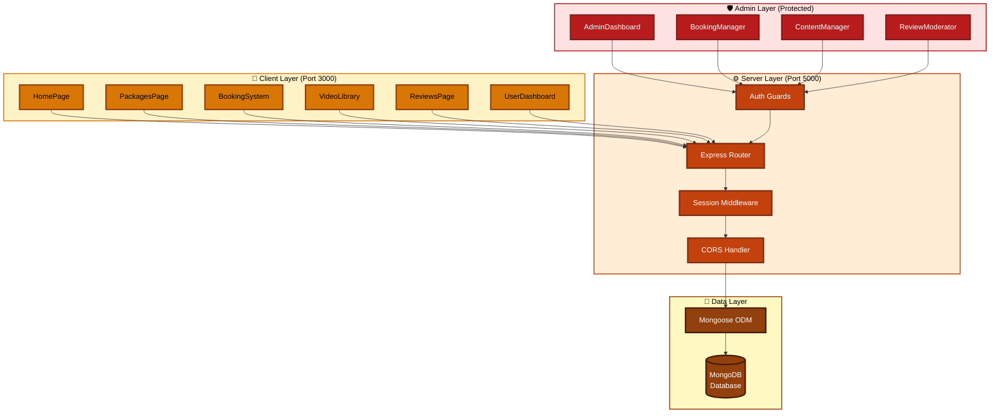
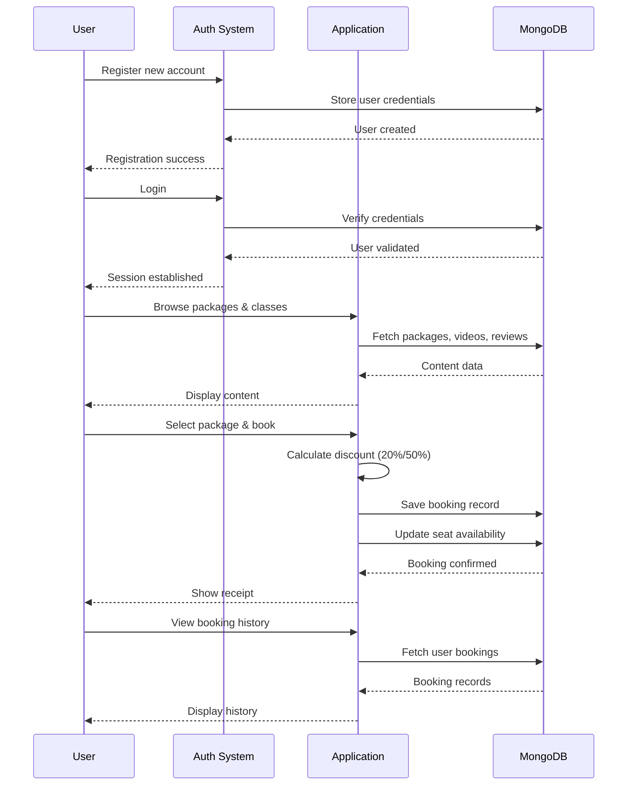
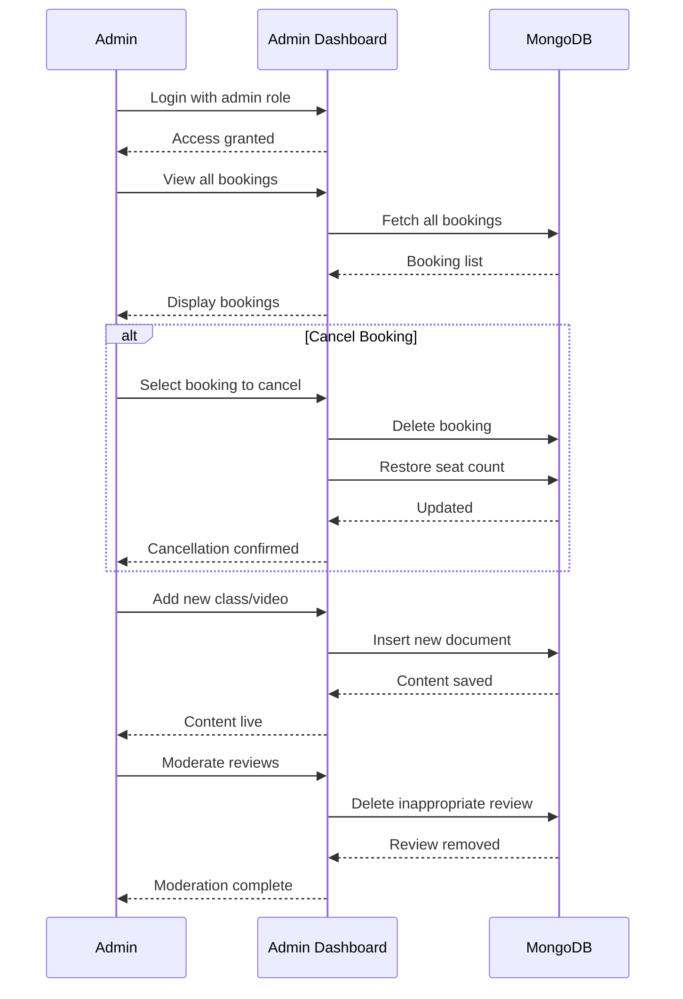

<!---------------------------------------------------------------------------->
<!--  HERO — Full-width waving banner                                        -->
<!---------------------------------------------------------------------------->

<div align="center">

</div>

<!---------------------------------------------------------------------------->
<!--  BADGES                                                                 -->
<!---------------------------------------------------------------------------->

<div align="center">

<br/>

[](https://developer.mozilla.org)&nbsp;
[](https://reactjs.org)&nbsp;
[](https://nodejs.org)&nbsp;
[](https://www.mongodb.com)&nbsp;
[](https://github.com/kumarpiyushraj/Fit-Yoga)

<br/><br/>

*Book mindfully &nbsp;·&nbsp; Train consistently &nbsp;·&nbsp; Live vibrantly*

<br/><br/>

</div>

<!---------------------------------------------------------------------------->
<!--  STATS STRIP                                                            -->
<!---------------------------------------------------------------------------->


<br/><br/>

<!---------------------------------------------------------------------------->
<!--  AT A GLANCE                                                            -->
<!---------------------------------------------------------------------------->

<div align="center">

### 📊 &nbsp;At a Glance

| 🌐 Stack | 🏗️ Architecture | 💾 Database | 🔐 Auth | 🎨 UI | ⚡ Routing |
|:---:|:---:|:---:|:---:|:---:|:---:|
| **MERN** | **RESTful API** | **MongoDB + Mongoose** | **express-session** | **Framer Motion + CSS3** | **React Router** |

</div>

<br/><br/>

<!---------------------------------------------------------------------------->
<!--  TABLE OF CONTENTS                                                      -->
<!---------------------------------------------------------------------------->


<br/>

<div align="center">

| # | Section | # | Section |
|:---:|:---|:---:|:---|
| 01 | <a href="#overview">🌟 Overview</a> | 07 | <a href="#api-endpoints">🔌 API Endpoints</a> |
| 02 | <a href="#features">✨ Features</a> | 08 | <a href="#installation">📥 Installation</a> |
| 03 | <a href="#user-features">👤 User Features</a> | 09 | <a href="#configuration">⚙️ Configuration</a> |
| 04 | <a href="#admin-features">🛡️ Admin Features</a> | 10 | <a href="#usage">🚀 Usage</a> |
| 05 | <a href="#tech-stack">🛠️ Tech Stack</a> | 11 | <a href="#future-enhancements">🔮 Future Enhancements</a> |
| 06 | <a href="#architecture">🏗️ System Architecture</a>

</div>

<br/><br/>

<a name="overview"></a>
<!---------------------------------------------------------------------------->
<!--  OVERVIEW                                                               -->
<!---------------------------------------------------------------------------->


<br/>

**Fit-Yoga** is a full-stack web application built with the **MERN stack** *(MongoDB, Express.js, React.js, Node.js)* that bridges traditional yoga practices with modern digital convenience. It provides a comprehensive **Fitness and Yoga Booking and Content Management System** — streamlining class bookings, content management, and user engagement in one unified platform.

<br/>

<div align="center">

| &nbsp; | What It Offers | How It Delivers |
|:---:|:---|:---|
| 🎟️ | **Smart Booking System** | Real-time seat tracking with automatic discount calculation |
| 📊 | **Admin Dashboard** | Powerful content, booking, and review management tools |
| 🎥 | **Video Library** | Instructional tutorials and fitness content on demand |
| 🎨 | **Modern Interface** | Responsive design with smooth Framer Motion animations |
| 🔒 | **Role-Based Access** | Secure session management for users and admins |

</div>

<br/><br/>

<a name="features"></a>
<!---------------------------------------------------------------------------->
<!--  FEATURES                                                               -->
<!---------------------------------------------------------------------------->


<br/>

<a name="user-features"></a>

### 👤 User Features

<div align="center">

| Feature | Detail |
|:---|:---|
| 🔐 **Authentication System** | Secure registration and login with session management |
| 📦 **Package Browsing** | View detailed fitness and yoga packages with pricing |
| 🎟️ **Smart Booking System** | Real-time seat availability, auto discounts, instant confirmation |
| 📚 **Class Listings** | Browse available yoga and fitness classes |
| 🎥 **Video Library** | Access instructional videos and tutorials |
| 📖 **Booking History** | Track all your bookings in one place |
| ⭐ **Reviews** | Read feedback from other users |

</div>

<br/>

---

<a name="admin-features"></a>

### 🛡️ Admin Features

<div align="center">

| Feature | Detail |
|:---|:---|
| 📊 **Booking Management** | View and cancel user bookings across the platform |
| ➕ **Content Management** | Add new classes and video tutorials effortlessly |
| 🗑️ **Review Moderation** | Manage user reviews for quality control |
| 👥 **User Oversight** | Monitor booking patterns and seat availability |

</div>

<br/>

---

### ⚡ Technical Highlights

<div align="center">

```
Smart Discount Engine:
  • 20% discount  →  for bookings of 20+ seats
  • 50% discount  →  for bookings of 50+ seats
  • Instant receipt generation on confirmation
```

</div>

<div align="center">

| Highlight | Implementation |
|:---|:---|
| 🔄 **Session Management** | Secure user sessions with `express-session` |
| 🎨 **Responsive Design** | Mobile-friendly interface with smooth animations |
| 🚀 **RESTful API** | Clean, structured backend architecture |
| 💾 **MongoDB Integration** | Efficient NoSQL operations with Mongoose ODM |
| 🔒 **Role-Based Access** | Separate user and admin functionality with protected routes |

</div>

<br/><br/>

<a name="tech-stack"></a>
<!---------------------------------------------------------------------------->
<!--  TECH STACK                                                             -->
<!---------------------------------------------------------------------------->


<br/>

<div align="center">

| Frontend | | Backend | |
|:---|:---|:---|:---|
| **React.js** | Component-based UI library | **Node.js** | JavaScript runtime environment |
| **React Router** | Client-side routing | **Express.js** | Web application framework |
| **Axios** | HTTP client for API requests | **MongoDB** | NoSQL database |
| **Framer Motion** | Animation library | **Mongoose** | MongoDB object modeling |
| **CSS3** | Custom styling with animations | **express-session** | Session middleware |
| | | **CORS** | Cross-origin resource sharing |

</div>

<br/>

### 🧰 Development Tools

<div align="center">

| Tool | Purpose |
|:---|:---|
| **Visual Studio Code** | Primary code editor |
| **MongoDB Compass** | Database management GUI |
| **dotenv** | Environment variable management |

</div>

<br/><br/>

<a name="architecture"></a>
<!---------------------------------------------------------------------------->
<!--  ARCHITECTURE                                                           -->
<!---------------------------------------------------------------------------->


<br/>



<br/>

### 🗄️ Database Schema

**Collections:**

<div align="center">

| Collection | Purpose |
|:---|:---|
| `users` | User credentials and roles |
| `classes` | Fitness and yoga class details |
| `packages` | Booking packages with pricing and availability |
| `bookings` | User booking records |
| `videos` | Tutorial video information |
| `reviews` | User feedback and ratings |

</div>

<br/><br/>

<a name="installation"></a>
<!---------------------------------------------------------------------------->
<!--  INSTALLATION                                                           -->
<!---------------------------------------------------------------------------->


<br/>

### Prerequisites

<div align="center">

| Requirement | Detail |
|:---|:---|
| 🟢 **Node.js** | v14 or higher |
| 🍃 **MongoDB** | v4 or higher |
| 📦 **Package Manager** | npm or yarn |

</div>

<br/>

**Step 1 — Clone the Repository**

```bash
git clone https://github.com/kumarpiyushraj/Fit-Yoga.git
cd fit-yoga
```

**Step 2 — Install Backend Dependencies**

```bash
cd backend
npm install
```

Required backend packages:

```json
{
  "express": "^4.18.0",
  "mongoose": "^6.0.0",
  "cors": "^2.8.5",
  "express-session": "^1.17.0",
  "dotenv": "^16.0.0"
}
```

**Step 3 — Install Frontend Dependencies**

```bash
cd ../frontend
npm install
```

Required frontend packages:

```json
{
  "react": "^18.2.0",
  "react-dom": "^18.2.0",
  "react-router-dom": "^6.0.0",
  "axios": "^1.0.0",
  "framer-motion": "^10.0.0"
}
```

**Step 4 — Setup MongoDB**

Ensure MongoDB is running locally or use a cloud instance (MongoDB Atlas).

<br/><br/>

<a name="configuration"></a>
<!---------------------------------------------------------------------------->
<!--  CONFIGURATION                                                          -->
<!---------------------------------------------------------------------------->


<br/>

### Backend Configuration

Create a `.env` file in the `backend` directory:

```env
# MongoDB Connection
MONGO_URI=mongodb://localhost:27017/FitnessYogaApp

# Session Secret
SESSION_SECRET=G8#j2Lr@9vPqXz$MnT3yB!dK

# Server Port
PORT=5000
```

### Frontend Configuration

Update API endpoints in your components if needed (default: `http://localhost:5000`).

<br/><br/>

<a name="usage"></a>
<!---------------------------------------------------------------------------->
<!--  USAGE                                                                  -->
<!---------------------------------------------------------------------------->


<br/>

### Running the Application

**Terminal 1 — Start Backend Server:**

```bash
cd backend
node server.js
# Server running on http://localhost:5000
```

**Terminal 2 — Start Frontend:**

```bash
cd frontend
npm start
# React app running on http://localhost:3000
```

### Default Admin Credentials

You'll need to manually create an admin user in MongoDB with `role: "admin"`.

<br/>

### User Workflow



<br/>

### Admin Workflow



<br/><br/>

<!---------------------------------------------------------------------------->
<!--  SCREENSHOTS                                                            -->
<!---------------------------------------------------------------------------->


<br/>

### 🎯 User Experience

<div align="center">

<table>
<tr>
<td align="center" width="33%">

<br/><br/><b>Homepage</b>
<br/><sub>Clean interface · Intuitive navigation · Call-to-action buttons</sub>
</td>
<td align="center" width="33%">

<br/><br/><b>Package Selection</b>
<br/><sub>Detailed pricing · Real-time seat availability · Auto discounts (20%/50%)</sub>
</td>
<td align="center" width="33%">

<br/><br/><b>Smart Booking System</b>
<br/><sub>Instant price calculation · Seat validation · Pre-filled user data</sub>
</td>
</tr>
</table>

</div>

<br/>

### 🧾 Booking & History

<div align="center">

<table>
<tr>
<td align="center" width="50%">

<br/><br/><b>Booking Confirmation</b>
<br/><sub>Complete booking details · Applied discounts · Receipt generation</sub>
</td>
<td align="center" width="50%">

<br/><br/><b>Personal Dashboard</b>
<br/><sub>Booking history · Date & time tracking · Pricing details</sub>
</td>
</tr>
</table>

</div>

<br/>

### 🎥 Content & Community

<div align="center">

<table>
<tr>
<td align="center" width="50%">

<br/><br/><b>Video Library</b>
<br/><sub>Embedded videos · Category filtering · Tutorial access</sub>
</td>
<td align="center" width="50%">

<br/><br/><b>Community Reviews</b>
<br/><sub>Star ratings · User testimonials · Feedback display</sub>
</td>
</tr>
</table>

</div>

<br/>

### 🔐 Authentication System

<div align="center">

<table>
<tr>
<td align="center" width="50%">

<br/><br/><b>User Sign In</b>
<br/><sub>Secure login · Session management · Role-based access</sub>
</td>
<td align="center" width="50%">

<br/><br/><b>User Registration</b>
<br/><sub>Form validation · Pattern matching · Error handling</sub>
</td>
</tr>
</table>

</div>

<br/>

### 🛡️ Administrative Control Panel

<div align="center">

<table>
<tr>
<td align="center" width="33%">

<br/><br/><b>Admin Dashboard</b>
<br/><sub>Booking overview · User management · Content control</sub>
</td>
<td align="center" width="33%">

<br/><br/><b>Class Management</b>
<br/><sub>Create classes · Set schedules · Assign instructors</sub>
</td>
<td align="center" width="33%">

<br/><br/><b>Review Moderation</b>
<br/><sub>View all reviews · Delete inappropriate content · Quality control</sub>
</td>
</tr>
</table>

</div>

<br/><br/>

<a name="api-endpoints"></a>
<!---------------------------------------------------------------------------->
<!--  API ENDPOINTS                                                          -->
<!---------------------------------------------------------------------------->


<br/>

### Authentication

| Method | Endpoint | Description |
|--------|----------|-------------|
| POST | `/api/register` | Register new user |
| POST | `/api/login` | User/Admin login |
| POST | `/api/logout` | Logout user |
| GET | `/api/currentUser` | Get session user |

### User Endpoints

| Method | Endpoint | Description |
|--------|----------|-------------|
| GET | `/api/classes` | Fetch all classes |
| GET | `/api/packages` | Fetch all packages |
| GET | `/api/videos` | Fetch all videos |
| GET | `/api/reviews` | Fetch all reviews |
| POST | `/api/bookings` | Create new booking |
| GET | `/api/userbookings` | Fetch user's bookings |

### Admin Endpoints *(Protected)*

| Method | Endpoint | Description |
|--------|----------|-------------|
| GET | `/api/admin/bookings` | View all bookings |
| DELETE | `/api/bookings/:id` | Cancel booking |
| POST | `/api/admin/classes` | Add new class |
| POST | `/api/admin/videos` | Add new video |
| GET | `/api/admin/reviews` | View all reviews |
| DELETE | `/api/admin/reviews/:id` | Delete review |

<br/><br/>

<a name="future-enhancements"></a>
<!---------------------------------------------------------------------------->
<!--  FUTURE ENHANCEMENTS                                                    -->
<!---------------------------------------------------------------------------->


<br/>

<details>
<summary><b>📦 Version 1.1 — Next Release</b></summary>

<br/>

- [ ] 💳 Payment Gateway Integration — Secure online payment processing
- [ ] 🔐 Password Encryption — bcrypt implementation
- [ ] 📧 Email Confirmations — Automated booking receipts
- [ ] 🔔 Push Notifications — Class reminders and updates

<br/>
</details>

<details>
<summary><b>📦 Version 1.2</b></summary>

<br/>

- [ ] 📱 Mobile Application — Native iOS and Android apps
- [ ] 🎬 Live Streaming — Real-time class broadcasting
- [ ] 📊 Analytics Dashboard — User engagement metrics
- [ ] 📈 Progress Tracking — User fitness journey monitoring

<br/>
</details>

<details>
<summary><b>🚀 Version 2.0 — Future Vision</b></summary>

<br/>

- [ ] 🤖 AI Recommendations — Personalized fitness plans
- [ ] 🌐 Multi-language Support — International accessibility
- [ ] ⌚ Wearable Integration — Connect with fitness trackers
- [ ] 📱 Cross-platform — Unified mobile and desktop experience

<br/>
</details>

<br/><br/>

<!---------------------------------------------------------------------------->
<!--  ACKNOWLEDGMENTS                                                        -->
<!---------------------------------------------------------------------------->


<br/>

<div align="center">

| &nbsp; | Acknowledgment |
|:---:|:---|
| 🌍 | **MERN Stack Community** — For excellent libraries and documentation |
| 💬 | **Stack Overflow Community** — For invaluable problem-solving assistance |
| 🌟 | **Open Source Contributors** — Everyone who helped shape this project |

</div>

<br/><br/>

<!---------------------------------------------------------------------------->
<!--  FOOTER                                                                 -->
<!---------------------------------------------------------------------------->

<div align="center">

<br/>

**Built with ❤️ for mindful living &nbsp;·&nbsp; React &nbsp;·&nbsp; Node.js &nbsp;·&nbsp; MongoDB**

<br/>

[](https://github.com/kumarpiyushraj/Fit-Yoga)

<br/>

*© 2025 Kumar Piyush Raj &nbsp;·&nbsp; [GitHub @kumarpiyushraj](https://github.com/kumarpiyushraj)*


</div>
